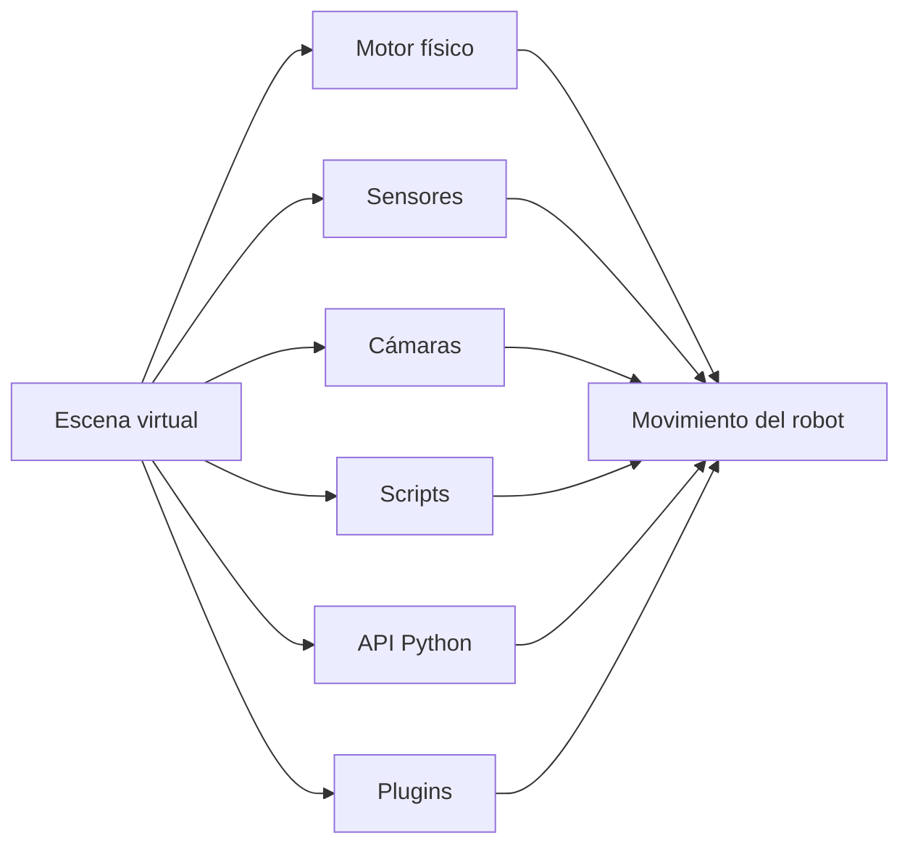
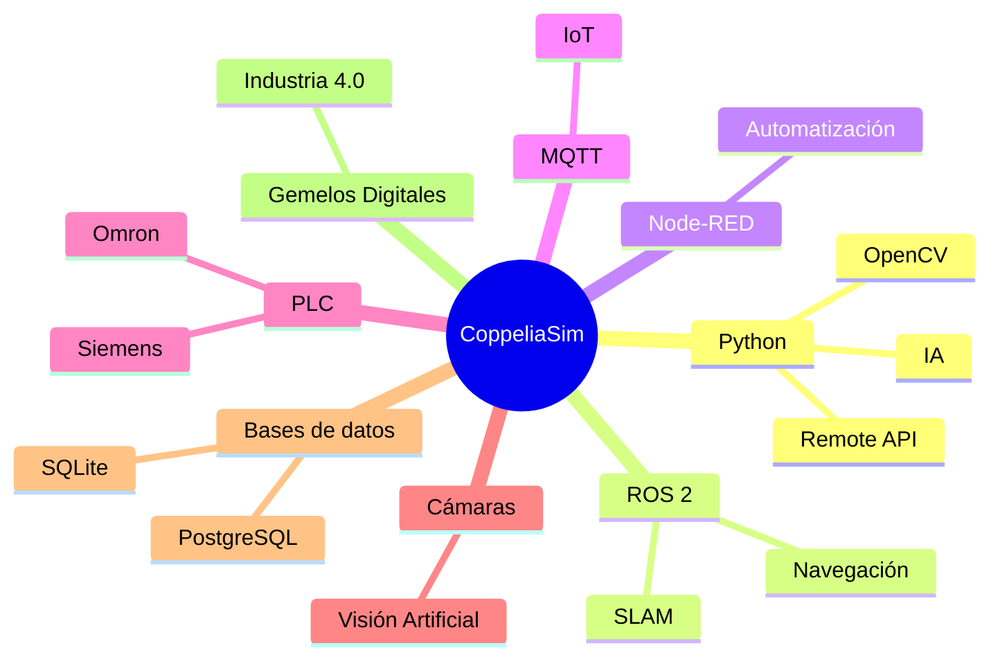

::: chapter-cover
number: 1
title: ¿Qué es CoppeliaSim?
time: 2 horas
level: ⭐☆☆☆☆ (Inicial)
:::

::: objectives
title: Objetivos del capítulo
content:

Al finalizar este capítulo serás capaz de:

- Comprender qué es un simulador de robots.
- Explicar qué es CoppeliaSim y cuáles son sus principales características.
- Conocer los ámbitos en los que se utiliza actualmente.
- Entender las ventajas de trabajar con simuladores antes de utilizar robots reales.
- Identificar el papel de CoppeliaSim en la Formación Profesional y en la Industria 4.0.
:::

# Capítulo 1 · ¿Qué es CoppeliaSim?

## ¿Serías capaz de programar un robot de 50.000 € sin haberlo probado antes?

Imagina que una empresa acaba de adquirir un brazo robótico industrial valorado en más de cincuenta mil euros. Tu tarea consiste en desarrollar el programa que controlará todos sus movimientos.

Cada error que cometas puede provocar una colisión, dañar una herramienta o incluso inutilizar parte de la instalación. Además del coste económico, existe un riesgo evidente para la seguridad de las personas que trabajan cerca del robot.

Ahora imagina una situación diferente.

Dispones de una copia virtual idéntica del robot. Puedes moverlo, programarlo, hacerlo chocar contra una pared, modificar su velocidad o cometer todos los errores que necesites sin romper absolutamente nada.

Ese entorno virtual es precisamente un **simulador robótico**.

Los simuladores permiten diseñar, probar y validar programas antes de ejecutarlos sobre un robot físico. Gracias a ellos es posible reducir costes, aumentar la seguridad y acelerar enormemente el desarrollo de aplicaciones robóticas.

En la actualidad, prácticamente todas las empresas que trabajan con automatización industrial utilizan algún tipo de simulador durante el diseño de sus instalaciones.

CoppeliaSim es uno de los más completos y versátiles.

::: teacher
content:

Comienza la primera clase planteando esta misma pregunta al alumnado.

No expliques inmediatamente qué es CoppeliaSim.

Permite que sean ellos quienes propongan posibles soluciones.

Esta pequeña reflexión suele ayudar a comprender rápidamente por qué existen los simuladores.
:::

---

# 1.1 ¿Qué es un simulador?

Un simulador es una aplicación informática capaz de reproducir el comportamiento de un sistema real mediante modelos matemáticos y físicos.

En otras palabras, permite construir una representación virtual de un objeto o de un proceso para estudiar su comportamiento sin necesidad de disponer del sistema real.

En robótica, un simulador puede reproducir:

- robots móviles;
- brazos industriales;
- sensores;
- cámaras;
- cintas transportadoras;
- almacenes automáticos;
- líneas completas de producción.

Todo ello dentro de un entorno tridimensional en el que es posible interactuar exactamente igual que se haría en una instalación real.

::: figure
image: ../assets/cap01/simulacion_vs_realidad.png
caption: Comparación entre una instalación física y su representación virtual.
:::

La calidad de un simulador depende de la precisión con la que reproduce el comportamiento del sistema real. Los simuladores modernos incorporan motores físicos capaces de calcular colisiones, gravedad, fricción, inercias y otras muchas propiedades mecánicas.

Gracias a ello, el comportamiento observado durante la simulación suele ser muy parecido al que posteriormente tendrá el robot físico.

::: glossary
id: robot_diferencial
:::

---

# 1.2 ¿Qué es exactamente CoppeliaSim?

Una vez comprendido el concepto de **simulador**, es el momento de responder a la pregunta principal de este capítulo.

## ¿Qué es CoppeliaSim?

CoppeliaSim es un entorno profesional de simulación robótica tridimensional que permite diseñar, construir, programar y probar robots completamente virtuales.

No se trata únicamente de un programa para visualizar robots en una pantalla. Es una plataforma capaz de reproducir con gran fidelidad el comportamiento de sistemas robóticos completos, incluyendo sensores, motores, cámaras, actuadores, mecanismos, cintas transportadoras e incluso instalaciones industriales enteras.

En otras palabras, CoppeliaSim permite construir un **laboratorio de robótica virtual** dentro del ordenador.

En ese laboratorio podremos experimentar con total libertad, probar ideas, cometer errores y aprender sin riesgo para las personas ni para el material.

::: figure
image: ../assets/cap01/coppeliasim_ecosistema.png
caption: CoppeliaSim permite integrar robots, sensores, cámaras, cintas transportadoras y otros elementos dentro de una misma simulación.
:::

Una de las características que diferencia a CoppeliaSim de otros simuladores es que no está pensado para un único tipo de robot.

En un mismo proyecto es posible trabajar con:

- robots móviles;
- brazos robóticos industriales;
- drones;
- robots humanoides;
- vehículos autónomos;
- sistemas de visión artificial;
- almacenes automáticos;
- líneas completas de fabricación.

Todo ello compartiendo el mismo espacio de simulación.

---

## Un simulador muy flexible

Muchos simuladores están orientados a un único fabricante o a un único ámbito de aplicación.

Por ejemplo, algunos se centran exclusivamente en robots industriales, mientras que otros están diseñados para robots móviles o para investigación universitaria.

CoppeliaSim adopta una filosofía diferente.

Su objetivo consiste en ofrecer un entorno abierto en el que cualquier tipo de robot pueda convivir con cualquier otro.

Esto significa que un mismo escenario puede contener:

- un brazo robótico que clasifica piezas;
- un robot móvil que transporta cajas;
- una cámara de visión artificial que inspecciona productos;
- una cinta transportadora;
- sensores de proximidad;
- un sistema de iluminación;
- varios PLC virtuales;
- aplicaciones externas escritas en Python.

Esta flexibilidad convierte a CoppeliaSim en una herramienta extraordinariamente útil tanto para la docencia como para la investigación y la industria.

---

## Mucho más que un simulador gráfico

A primera vista puede parecer un programa para crear animaciones tridimensionales.

Sin embargo, internamente ocurren muchas cosas al mismo tiempo.

Cada vez que ejecutamos una simulación intervienen diferentes componentes especializados.

Mientras observamos el movimiento del robot, el simulador está calculando continuamente:

- la gravedad;
- las colisiones;
- las fuerzas aplicadas;
- las velocidades;
- la posición de cada articulación;
- la información de todos los sensores.

Todo ello sucede cientos de veces por segundo.

Por ese motivo, aunque visualmente parezca un videojuego, en realidad estamos utilizando una herramienta de ingeniería.

::: teacher
content:

Es frecuente que el alumnado compare CoppeliaSim con un videojuego.

Aprovecha esa comparación para explicar la diferencia entre una representación gráfica y una simulación física.

Un videojuego busca entretener.

Un simulador busca reproducir el comportamiento de un sistema real con la mayor fidelidad posible.
:::

---

## ¿Qué hace especial a CoppeliaSim?

Existen numerosos simuladores de robótica.

Entonces, ¿por qué dedicar un libro completo a CoppeliaSim?

Las razones son muchas, pero destacan especialmente las siguientes.

::: table
caption: Principales características de CoppeliaSim.
content:

| Característica | Ventaja para el docente |
|----------------|------------------------|
| Gratuito para uso educativo | Permite instalarlo en todos los equipos del aula. |
| Multiplataforma | Funciona en Windows, Linux y macOS. |
| Muy ligero | No requiere un ordenador extremadamente potente. |
| Compatible con Python | Ideal para Formación Profesional. |
| Gran biblioteca de modelos | Reduce el tiempo de preparación de las prácticas. |
| Arquitectura abierta | Permite conectar aplicaciones externas mediante diferentes APIs. |
| Amplia comunidad | Existe abundante documentación y ejemplos disponibles. |
:::

Estas características hacen que sea especialmente adecuado para el aprendizaje.

Durante este libro utilizaremos únicamente una pequeña parte de sus posibilidades, pero será suficiente para desarrollar proyectos muy interesantes.

---

## El papel de Python

Aunque CoppeliaSim puede programarse mediante diferentes lenguajes, en este libro utilizaremos **Python** prácticamente desde el primer momento.

La razón es sencilla.

Python se ha convertido en uno de los lenguajes más utilizados en robótica, inteligencia artificial, visión artificial y análisis de datos.

Además, su sintaxis es sencilla y permite concentrarse en los algoritmos sin perder tiempo en detalles del lenguaje.

En capítulos posteriores aprenderemos cómo conectar un programa Python con CoppeliaSim utilizando la **Remote API**.

::: python
id: RemoteAPIClient
:::

Por el momento basta con saber que Python actuará como el "cerebro" que enviará órdenes al robot virtual.

---

## Primera toma de contacto

Antes de continuar, dedica unos minutos a explorar la página principal de Coppelia Robotics.

No es necesario comprender todavía todos los conceptos que aparecen.

Simplemente observa la enorme variedad de aplicaciones que pueden desarrollarse utilizando este simulador.

El objetivo de este libro será que, al finalizar el curso, seas capaz de construir muchas de ellas por ti mismo.

---

# 1.3 La evolución de la simulación robótica

La robótica moderna sería prácticamente impensable sin la simulación.

Hoy resulta normal diseñar un robot virtual, probar cientos de programas, optimizar trayectorias e incluso entrenar algoritmos de inteligencia artificial antes de construir el robot físico.

Sin embargo, esto no siempre fue así.

Durante muchos años, la única forma de comprobar si un programa funcionaba consistía en ejecutarlo directamente sobre el robot real.

Cada prueba suponía detener la producción, reservar tiempo de laboratorio y asumir el riesgo de provocar averías o accidentes.

La simulación cambió completamente esta forma de trabajar.

---

## Los primeros simuladores

Los primeros simuladores aparecieron en universidades y centros de investigación durante la década de 1980.

Su aspecto era muy diferente al actual.

Las escenas estaban formadas por simples líneas y figuras geométricas, sin texturas, iluminación ni motores físicos.

El objetivo no era crear gráficos espectaculares, sino verificar que los algoritmos de control funcionaban correctamente.

La capacidad de cálculo de los ordenadores de aquella época era muy limitada y obligaba a simplificar enormemente las simulaciones.

Aun así, aquellos primeros programas demostraron una idea revolucionaria:

> Era posible desarrollar un robot sin necesidad de disponer físicamente de él.

---

## La llegada de la simulación moderna

Con el aumento de la potencia de los ordenadores comenzaron a aparecer simuladores mucho más realistas.

Estos nuevos entornos incorporaban:

- motores físicos;
- cálculo de colisiones;
- gravedad;
- fricción;
- sensores virtuales;
- cámaras;
- iluminación;
- modelos tridimensionales.

Gracias a ello, las simulaciones empezaron a comportarse de una forma muy parecida a la realidad.

La simulación dejó de ser una simple herramienta de investigación para convertirse en una parte fundamental del desarrollo industrial.

---

## De V-REP a CoppeliaSim

El origen de CoppeliaSim se encuentra en un simulador llamado **V-REP (Virtual Robot Experimentation Platform)**.

Durante muchos años, V-REP fue utilizado en universidades de todo el mundo para la investigación y la enseñanza de la robótica.

Con el paso del tiempo el proyecto evolucionó considerablemente.

No solo se añadieron nuevas funcionalidades, sino que también cambió la arquitectura interna del programa para hacerlo más modular, más rápido y más flexible.

Como consecuencia de esta evolución, el proyecto adoptó un nuevo nombre:

**CoppeliaSim**.

Aunque muchos documentos antiguos siguen haciendo referencia a V-REP, actualmente ambos nombres hacen referencia a distintas etapas del mismo proyecto.

::: common-error
content:

Es habitual encontrar tutoriales antiguos que hablan de **V-REP**.

En la mayoría de los casos los conceptos siguen siendo válidos, aunque algunos menús, iconos o funciones hayan cambiado de nombre en las versiones actuales de CoppeliaSim.
:::

---

## La simulación en la Industria 4.0

La Industria 4.0 ha transformado completamente la manera de diseñar y mantener instalaciones industriales.

Actualmente es habitual construir primero una copia virtual de una fábrica antes de comenzar su montaje físico.

Esta copia recibe el nombre de **gemelo digital** (*Digital Twin*).

Un gemelo digital permite:

- comprobar que todos los robots pueden trabajar sin colisionar;
- optimizar tiempos de producción;
- detectar errores de diseño;
- entrenar algoritmos de inteligencia artificial;
- planificar tareas de mantenimiento;
- formar a nuevos operarios.

CoppeliaSim puede utilizarse como una de las herramientas para construir este tipo de modelos virtuales.

En los últimos capítulos del libro desarrollaremos un pequeño gemelo digital utilizando varias de las tecnologías que ya conocerás.

---

## Simulación y Formación Profesional

En Formación Profesional la simulación aporta ventajas especialmente interesantes.

Muchos centros educativos no disponen de un laboratorio con varios robots industriales.

Incluso cuando existen, el número de alumnos suele ser muy superior al número de equipos disponibles.

La simulación permite que todos los estudiantes trabajen simultáneamente con robots idénticos.

Además:

- elimina el riesgo de accidentes durante las primeras prácticas;
- permite experimentar libremente;
- facilita repetir una actividad tantas veces como sea necesario;
- reduce enormemente los costes de mantenimiento.

Por este motivo cada vez más centros educativos incorporan simuladores dentro de sus módulos de Automatización, Robótica, Mecatrónica e Informática Industrial.

::: teacher
content:

No presentes CoppeliaSim como un sustituto del robot real.

Explícalo como una herramienta complementaria.

Siempre que sea posible, combina simulación y robótica física.

Los alumnos comprenderán mucho mejor la relación entre ambos mundos.
:::

---

## ¿Qué lugar ocupa CoppeliaSim?

Actualmente existen numerosos simuladores robóticos.

Cada uno está orientado a un tipo de usuario diferente.

Algunos están especializados en investigación.

Otros en robótica industrial.

Otros en conducción autónoma.

Otros en aprendizaje mediante inteligencia artificial.

CoppeliaSim destaca por ofrecer un equilibrio muy interesante entre potencia, facilidad de uso y flexibilidad.

Por ello resulta especialmente adecuado para:

- enseñanza;
- investigación;
- desarrollo de prototipos;
- proyectos de ingeniería;
- integración con Python;
- integración con ROS;
- visión artificial;
- Internet de las Cosas;
- inteligencia artificial.

Precisamente esa versatilidad es una de las razones por las que lo utilizaremos a lo largo de este libro.

---

## Una habilidad con mucho futuro

Aprender a utilizar un simulador no consiste únicamente en conocer un programa informático.

Significa adquirir una forma de trabajar utilizada diariamente por ingenieros, investigadores y empresas tecnológicas de todo el mundo.

En los próximos capítulos aprenderás a crear escenas, controlar robots, utilizar sensores, conectar aplicaciones Python y desarrollar pequeños gemelos digitales.

Todo ello comenzará con un simple simulador instalado en tu ordenador.

Pero las competencias que adquirirás serán las mismas que utilizan muchos profesionales en proyectos reales.

---

# 1.4 ¿Quién utiliza CoppeliaSim?

Cuando una persona instala CoppeliaSim por primera vez suele pensar que se trata de un programa pensado únicamente para estudiantes o aficionados a la robótica.

Nada más lejos de la realidad.

Aunque es una herramienta excelente para el aprendizaje, CoppeliaSim también forma parte del trabajo diario de investigadores, ingenieros y desarrolladores de todo el mundo.

Comprender quién utiliza este simulador nos ayudará a entender por qué merece la pena invertir tiempo en aprenderlo.

---

## Universidades y centros educativos

Probablemente el ámbito en el que CoppeliaSim está más extendido sea la enseñanza superior.

Miles de estudiantes de ingeniería, informática, electrónica, automática y robótica realizan sus primeras prácticas utilizando este simulador.

La razón es sencilla.

Un laboratorio con varios robots industriales supone una inversión muy elevada.

Además del coste de adquisición, es necesario disponer de:

- espacio físico;
- medidas de seguridad;
- mantenimiento especializado;
- herramientas específicas;
- personal formado.

Gracias a la simulación, cualquier alumno puede disponer de un laboratorio completo instalado en su propio ordenador.

Esto democratiza enormemente el acceso a la robótica.

::: teacher
content:

Si impartes clases de Formación Profesional, puedes instalar exactamente el mismo entorno de trabajo en todos los equipos del aula.

Esto evita que unos alumnos trabajen con robots diferentes o con versiones distintas del software.
:::

---

## Centros de investigación

Los grupos de investigación utilizan CoppeliaSim para desarrollar nuevos algoritmos antes de probarlos sobre robots reales.

Por ejemplo:

- navegación autónoma;
- planificación de trayectorias;
- visión artificial;
- aprendizaje automático;
- robótica colaborativa;
- manipulación de objetos;
- inteligencia artificial.

En muchas ocasiones el robot físico ni siquiera existe todavía.

La investigación comienza completamente dentro del simulador.

Solo cuando los resultados son satisfactorios se construye el primer prototipo.

---

## Empresas industriales

Las empresas también utilizan simuladores durante las diferentes fases de un proyecto.

Antes de instalar una nueva línea de producción es habitual comprobar virtualmente que todo funcionará correctamente.

Entre otras tareas pueden verificarse:

- el alcance de un brazo robótico;
- posibles colisiones;
- tiempos de ciclo;
- accesibilidad para el mantenimiento;
- posición de sensores;
- funcionamiento de cámaras;
- circulación de robots móviles.

Detectar un problema durante la simulación cuesta apenas unos minutos.

Detectarlo una vez instalada la maquinaria puede implicar horas o incluso días de parada de producción.

---

## Desarrolladores de software

Los programadores encuentran en CoppeliaSim un entorno ideal para desarrollar aplicaciones robóticas.

En lugar de depender continuamente del robot físico, pueden probar sus programas tantas veces como sea necesario.

Esto acelera enormemente el desarrollo.

En este libro utilizaremos principalmente **Python**, aunque CoppeliaSim también puede comunicarse con otros lenguajes y plataformas.

::: python
id: RemoteAPIClient
:::

Más adelante aprenderemos cómo un sencillo programa Python puede controlar un robot virtual exactamente igual que si estuviera conectado a un robot real.

---

## Makers y aficionados

No es necesario trabajar en una gran empresa para aprovechar las ventajas de CoppeliaSim.

Muchos aficionados a la robótica utilizan el simulador para:

- aprender programación;
- diseñar robots;
- experimentar con sensores;
- probar algoritmos;
- preparar competiciones.

La posibilidad de cometer errores sin romper ningún componente convierte el simulador en un entorno perfecto para aprender.

---

## Un mismo ecosistema

Una de las mayores ventajas de CoppeliaSim es su enorme capacidad de integración.

No trabaja de forma aislada.

Puede comunicarse con multitud de aplicaciones externas.

A lo largo del libro iremos incorporando progresivamente muchas de estas tecnologías.

No será necesario conocerlas desde el principio.

Cada una aparecerá cuando resulte útil para resolver un problema concreto.

---

## Lo que aprenderemos en este libro

Nuestro objetivo no consiste únicamente en mover un robot hacia delante y hacia atrás.

Eso será solo el punto de partida.

Al finalizar el recorrido habrás desarrollado proyectos que combinarán distintas tecnologías utilizadas actualmente en la industria y en la investigación.

Entre otras aprenderás a utilizar:

::: table
caption: Tecnologías que se utilizarán a lo largo del libro.
content:

| Tecnología | Aplicación |
|------------|------------|
| Python | Programación de robots |
| OpenCV | Visión artificial |
| Node-RED | Automatización y paneles de control |
| MQTT | Comunicación IoT |
| Inteligencia Artificial | Toma de decisiones |
| Gemelos digitales | Simulación industrial |
| Cámaras virtuales | Procesamiento de imágenes |
| Sensores | Navegación y percepción |
| Bases de datos | Registro de información |
:::

Como puedes comprobar, aprender CoppeliaSim significa mucho más que aprender un simulador.

Significa adquirir una base sólida para desarrollar proyectos completos de robótica.

---

::: challenge
title: Reflexiona

content:

Busca en Internet tres aplicaciones reales de la robótica donde creas que un simulador como CoppeliaSim podría resultar útil.

No busques únicamente robots industriales.

Piensa también en agricultura, medicina, logística, educación o exploración espacial.

Comenta tus conclusiones con el resto de la clase.
:::

---

# 1.5 ¿Qué se puede simular con CoppeliaSim?

Una de las primeras preguntas que suelen hacer los alumnos cuando conocen CoppeliaSim es muy sencilla:

> **¿Qué tipo de robots puedo crear con este programa?**

La respuesta sorprende a la mayoría de las personas.

**Prácticamente cualquier sistema robótico que puedas imaginar.**

CoppeliaSim no está limitado a un único fabricante ni a una única familia de robots. Su arquitectura abierta permite combinar multitud de elementos dentro de una misma escena.

Gracias a ello podemos crear desde un pequeño robot móvil hasta una fábrica completamente automatizada.

A continuación veremos algunos ejemplos.

---

## Robots móviles

Los robots móviles son probablemente los más utilizados durante las primeras prácticas de robótica.

Se desplazan por el suelo utilizando ruedas, orugas o patas y son ideales para aprender conceptos como:

- movimiento diferencial;
- navegación;
- planificación de trayectorias;
- evitación de obstáculos;
- seguimiento de líneas;
- localización.

::: figure
image: ../assets/cap01/mobile_robots.png
caption: Ejemplos de robots móviles disponibles en CoppeliaSim.
:::

Durante este libro trabajaremos principalmente con el **Pioneer P3DX**, uno de los robots más utilizados en universidades de todo el mundo.

::: robot
id: PioneerP3DX
:::

Este robot será nuestro compañero durante buena parte del libro.

Con él aprenderemos desde los movimientos más sencillos hasta el uso de sensores, cámaras e inteligencia artificial.

---

## Brazos robóticos industriales

Los brazos robóticos constituyen la imagen más conocida de la automatización industrial.

Se utilizan para realizar tareas repetitivas con una precisión muy elevada.

Entre otras aplicaciones encontramos:

- soldadura;
- pintura;
- montaje;
- manipulación de piezas;
- clasificación;
- paletizado;
- inspección.

::: figure
image: ../assets/cap01/industrial_robot.png
caption: Simulación de un brazo robótico industrial.
:::

Aunque en este libro nos centraremos principalmente en robótica móvil, en los últimos capítulos realizaremos una introducción al control de brazos robóticos.

---

## Robots colaborativos (Cobots)

En los últimos años han aparecido los llamados **robots colaborativos**, también conocidos como **cobots**.

A diferencia de los robots industriales tradicionales, los cobots están diseñados para compartir espacio de trabajo con las personas.

Son especialmente habituales en pequeñas y medianas empresas debido a su facilidad de programación y a su gran flexibilidad.

Uno de los robots que utilizaremos como ejemplo será el **Universal Robots UR3e**.

Muchos centros de Formación Profesional ya disponen de este tipo de robots en sus talleres.

Esto permitirá trasladar fácilmente las prácticas del simulador al laboratorio físico.

---

## Drones y robots aéreos

CoppeliaSim también permite trabajar con vehículos aéreos no tripulados.

Estos modelos resultan muy interesantes para experimentar con:

- control automático;
- navegación;
- planificación de rutas;
- visión artificial;
- inteligencia artificial.

Aunque no profundizaremos en este ámbito, es interesante conocer que el simulador también ofrece esta posibilidad.

---

## Vehículos autónomos

La simulación resulta fundamental para el desarrollo de vehículos autónomos.

Antes de probar un algoritmo sobre un vehículo real, es habitual entrenarlo miles de veces en un entorno virtual.

Esto permite:

- reducir riesgos;
- ahorrar costes;
- generar situaciones difíciles de reproducir en el mundo real;
- evaluar el comportamiento del sistema.

Muchos algoritmos modernos de conducción autónoma han sido entrenados inicialmente mediante simulación.

---

## Sensores

Un robot sin sensores sería completamente incapaz de interactuar con su entorno.

CoppeliaSim incorpora una amplia colección de sensores virtuales.

Entre ellos encontramos:

- sensores de proximidad;
- cámaras RGB;
- cámaras de profundidad;
- sensores láser;
- sensores de visión;
- sensores de fuerza;
- sensores táctiles.

::: sensor
id: UltrasonicSensor
:::

Gracias a estos dispositivos el robot puede "percibir" lo que ocurre a su alrededor.

En capítulos posteriores aprenderemos cómo leer la información proporcionada por estos sensores desde Python.

---

## Cámaras y visión artificial

La visión artificial constituye una de las áreas más apasionantes de la robótica moderna.

En lugar de utilizar únicamente sensores de distancia, los robots pueden interpretar imágenes del mismo modo que lo hace una persona.

Esto permite realizar tareas como:

- reconocer objetos;
- leer códigos QR;
- identificar colores;
- localizar piezas;
- inspeccionar productos;
- seguir líneas;
- detectar personas.

Más adelante integraremos CoppeliaSim con **OpenCV** para desarrollar pequeños proyectos de visión artificial.

---

## Instalaciones industriales completas

Quizá la característica más impresionante de CoppeliaSim sea la posibilidad de construir instalaciones completas.

Dentro de una misma escena podemos combinar:

- robots móviles;
- brazos robóticos;
- cintas transportadoras;
- sensores;
- cámaras;
- PLC;
- sistemas de visión;
- almacenes automáticos.

Este tipo de simulaciones reciben actualmente el nombre de **gemelos digitales**.

En la última parte del libro construiremos uno paso a paso.

---

## Un único entorno para aprenderlo todo

Una de las mayores ventajas de CoppeliaSim es que todas estas tecnologías conviven dentro del mismo programa.

No será necesario aprender un simulador diferente para cada tipo de robot.

A medida que avances en el libro irás descubriendo nuevas posibilidades sin abandonar el entorno de trabajo que aprenderás durante las primeras prácticas.

Ese es precisamente uno de los grandes objetivos de esta obra:

**comenzar con un sencillo robot móvil y terminar desarrollando pequeños sistemas robóticos completos utilizando herramientas reales empleadas actualmente en la industria.**

::: summary
title: Idea clave
content:

CoppeliaSim no es únicamente un simulador para mover robots.

Es una plataforma completa que permite diseñar, programar, probar e integrar sistemas robóticos de muy distinta naturaleza.

Dominar esta herramienta significa adquirir una base sólida sobre la que construir proyectos cada vez más complejos.
:::

---

# 1.6 ¿Por qué utilizar un simulador antes que un robot real?

Cuando un estudiante comienza a aprender robótica suele pensar que lo ideal sería trabajar desde el primer día con un robot físico.

Aunque esta idea resulta muy atractiva, la realidad es que la inmensa mayoría de proyectos profesionales comienzan precisamente al contrario: utilizando un simulador.

La simulación no pretende sustituir al robot real, sino preparar el trabajo que posteriormente se realizará sobre él.

En otras palabras, el simulador es un entorno seguro donde experimentar, equivocarse y aprender.

---

## Aprender sin miedo a romper nada

Todos los alumnos cometen errores durante las primeras prácticas.

Es completamente normal.

Por ejemplo:

- invertir el sentido de giro de un motor;
- mover un robot demasiado rápido;
- provocar una colisión;
- escribir un algoritmo incorrecto;
- enviar órdenes equivocadas.

En un robot real, estos errores pueden provocar averías, roturas o incluso situaciones de riesgo.

En un simulador, el peor resultado posible consiste en reiniciar la escena y volver a empezar.

Esta libertad favorece enormemente el aprendizaje.

::: common-error
content:

Muchos estudiantes intentan evitar cualquier error.

Explícales que equivocarse forma parte del proceso de aprendizaje.

En un simulador, los errores son una oportunidad para comprender mejor el funcionamiento del sistema.
:::

---

## Reducir costes

Un robot industrial puede costar decenas o incluso cientos de miles de euros.

A ello debemos añadir:

- herramientas;
- mantenimiento;
- formación;
- espacio físico;
- elementos de seguridad.

Con un simulador, todos los alumnos pueden disponer de su propio laboratorio virtual utilizando un ordenador convencional.

---

## Trabajar desde cualquier lugar

Una de las mayores ventajas de CoppeliaSim es que no depende del laboratorio del centro.

El alumno puede continuar las prácticas:

- en casa;
- en la biblioteca;
- durante las prácticas en empresa;
- desde un ordenador personal.

Esto favorece enormemente el aprendizaje autónomo.

---

## Preparar el trabajo real

En muchas empresas, los programas que finalmente controlarán un robot industrial se desarrollan inicialmente sobre un modelo virtual.

Solo cuando el comportamiento es correcto se transfieren al robot físico.

Este procedimiento reduce:

- tiempos de parada;
- costes;
- riesgos;
- errores de puesta en marcha.

La simulación forma parte del flujo normal de trabajo de numerosos proyectos industriales.

---

# 1.7 CoppeliaSim en la Formación Profesional

Uno de los objetivos de este libro es acercar la robótica profesional a las aulas de Formación Profesional.

Durante los próximos capítulos utilizaremos CoppeliaSim como hilo conductor para aprender conceptos que posteriormente podrán aplicarse sobre robots reales.

Las prácticas han sido diseñadas pensando en un aula de FP.

Comenzaremos con actividades muy sencillas y, progresivamente, incorporaremos nuevas tecnologías.

Al finalizar el libro habremos trabajado con:

- programación en Python;
- sensores virtuales;
- visión artificial;
- OpenCV;
- Node-RED;
- MQTT;
- Inteligencia Artificial;
- gemelos digitales.

Todo ello utilizando un único entorno de simulación.

::: teacher
content:

No intentes explicar todas las posibilidades de CoppeliaSim durante las primeras semanas.

Permite que el alumnado descubra nuevas funcionalidades conforme avance el curso.

La motivación aumenta cuando cada capítulo incorpora una novedad.
:::

---

# 1.8 Comparación con otros simuladores

Actualmente existen numerosos simuladores robóticos.

Cada uno responde a necesidades diferentes.

::: table
caption: Comparación general entre algunos simuladores robóticos.
content:

| Simulador | Principal ámbito de uso |
|------------|------------------------|
| CoppeliaSim | Docencia, investigación e integración |
| Gazebo | ROS y robótica móvil |
| Isaac Sim | Inteligencia Artificial y NVIDIA |
| Webots | Educación e investigación |
| RoboDK | Robótica industrial offline |
:::

No existe un simulador "mejor" que todos los demás.

La elección depende del tipo de proyecto.

En este libro utilizaremos CoppeliaSim porque ofrece un excelente equilibrio entre facilidad de aprendizaje, potencia y posibilidades de integración.

---

::: summary
title: Resumen del capítulo

content:

En este primer capítulo hemos descubierto qué es un simulador robótico y por qué constituye una herramienta fundamental en el desarrollo de sistemas automatizados.

También hemos conocido qué es CoppeliaSim, cómo ha evolucionado a lo largo del tiempo y cuáles son sus principales ámbitos de aplicación.

A partir del siguiente capítulo comenzaremos a preparar nuestro entorno de trabajo instalando el software y realizando la configuración inicial.
:::

---

# Ejercicios

::: exercise
title: Comprensión

content:

Responde a las siguientes preguntas.

1. ¿Qué es un simulador robótico?

2. ¿Qué ventajas ofrece respecto a un robot físico?

3. ¿Qué tipos de robots pueden simularse con CoppeliaSim?

4. ¿Por qué es tan utilizado en universidades?

5. ¿Qué tecnologías estudiaremos durante este libro?
:::

---

::: exercise
title: Investigación

content:

Busca información sobre otro simulador robótico diferente de CoppeliaSim.

Elabora una ficha indicando:

- nombre;
- empresa desarrolladora;
- aplicaciones principales;
- ventajas;
- inconvenientes.

Finalmente, compara tus resultados con CoppeliaSim.
:::

---

::: practice
title: Primer contacto con CoppeliaSim

difficulty: Muy baja

time: 20 minutos

content:

En esta primera práctica no programaremos ningún robot.

El objetivo consiste simplemente en conocer el simulador.

1. Abre CoppeliaSim.
2. Observa la ventana principal.
3. Localiza el árbol de la escena.
4. Explora el Model Browser.
5. Identifica los controles de simulación.
6. Cierra el programa.

No te preocupes si todavía no entiendes todas las opciones.

Durante los próximos capítulos iremos descubriendo cada una de ellas con detalle.
:::

---

::: challenge
title: Un laboratorio del futuro

content:

Imagina que debes diseñar un laboratorio de robótica para un centro de Formación Profesional.

Dispones de un presupuesto limitado.

¿Qué equipamiento comprarías?

¿Qué papel tendría CoppeliaSim dentro del laboratorio?

Justifica tu propuesta.
:::

---

# Para el profesor

::: teacher
title: Organización de la sesión

content:

**Duración recomendada**

2 sesiones de 55 minutos.

**Material necesario**

- Ordenadores con CoppeliaSim instalado.
- Proyector.
- Conexión a Internet.
- Este libro.

**Objetivo principal**

Que el alumnado comprenda qué es un simulador y por qué va a utilizarlo durante el curso.

No es necesario explicar todavía el funcionamiento interno de CoppeliaSim.

Es preferible despertar la curiosidad y generar expectativas sobre las prácticas que se realizarán en los siguientes capítulos.

Finaliza la sesión mostrando algunos ejemplos espectaculares de robots simulados.

Los alumnos comprenderán que todo lo que han visto será capaz de realizarlo por sí mismos a medida que avance el curso.
:::