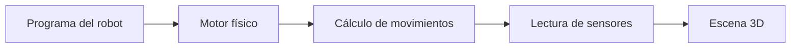
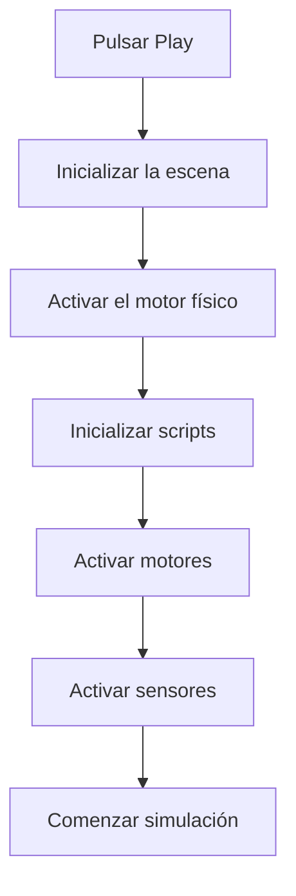
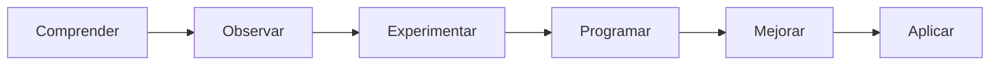

# Capítulo 1. ¿Qué es CoppeliaSim?

!!! abstract "Objetivos del capítulo"

    Al finalizar este capítulo serás capaz de:

    - Comprender qué es un simulador de robótica.
    - Explicar por qué la simulación es una herramienta fundamental en la industria.
    - Identificar las principales características de CoppeliaSim.
    - Conocer qué aplicaciones tiene dentro de la Formación Profesional.
    - Entender la metodología de trabajo que seguiremos durante todo el libro.

---

# 1.1 Introducción

Cuando pensamos en un robot, normalmente imaginamos una máquina física capaz de desplazarse, manipular objetos o realizar tareas de forma automática. Sin embargo, la realidad es que muy pocos robots comienzan su vida sobre una mesa de trabajo o en una fábrica.

Antes de que exista el primer prototipo físico, casi todos los robots modernos pasan por un simulador.

En ese entorno virtual los ingenieros prueban cientos o miles de programas diferentes, verifican que el robot es capaz de realizar las tareas previstas y detectan errores antes de fabricar una sola pieza.

Este proceso reduce enormemente los costes de desarrollo y disminuye el riesgo de averías.

En este libro seguiremos exactamente esa misma metodología.

Primero aprenderemos a programar robots virtuales.

Después, cuando dominemos los conceptos fundamentales, estaremos preparados para trabajar con robots reales.

!!! tip "Consejo para el profesor"

    Antes de comenzar la clase pregunta a los alumnos:

    **¿Dónde creéis que se programa por primera vez un robot industrial?**

    La mayoría responderá que directamente sobre el robot.

    Esa respuesta servirá para introducir la importancia de la simulación.

---

# 1.2 ¿Qué es un simulador?

Un simulador es un programa capaz de reproducir el comportamiento de un sistema real mediante modelos matemáticos y físicos.

En otras palabras, intenta responder continuamente a la siguiente pregunta:

> **¿Qué ocurriría si este robot existiera realmente?**

Para conseguirlo debe calcular continuamente numerosos parámetros:

- gravedad
- masas
- rozamientos
- colisiones
- aceleraciones
- velocidades
- fuerzas
- inercia
- motores
- sensores
- cámaras
- iluminación

Todo ello sucede cientos o incluso miles de veces por segundo.

El usuario únicamente observa el resultado final en pantalla, pero internamente el simulador está realizando miles de cálculos matemáticos.

---

# 1.3 ¿Por qué utilizar simulación?

Imaginemos que disponemos únicamente de un robot físico.

Cada vez que un alumno quiera probar un programa deberá esperar a que el compañero anterior termine.

Si el programa contiene un error, el robot puede:

- chocar contra una pared;
- caer de una mesa;
- romper un sensor;
- dañar un motor.

Además, el número de robots disponibles en un centro educativo suele ser muy reducido.

Con un simulador desaparecen prácticamente todos estos problemas.

Cada alumno dispone de su propio robot virtual.

Puede repetir una práctica tantas veces como necesite.

Puede experimentar sin miedo.

Puede equivocarse.

Y aprender de sus errores.

---

## Comparación

| Robot físico | Robot simulado |
|--------------|----------------|
| Coste elevado | Coste muy reducido |
| Riesgo de averías | Sin riesgo físico |
| Número limitado | Uno por alumno |
| Necesita espacio | Solo un ordenador |
| Reparaciones | Reiniciar la simulación |

---

!!! note "Idea clave"

    La simulación **no sustituye** al robot físico.

    Lo complementa.

    El objetivo es llegar al robot real con un programa ya probado y comprendido.

---

# 1.4 ¿Qué es CoppeliaSim?

CoppeliaSim es un simulador profesional de robótica desarrollado por la empresa suiza **Coppelia Robotics AG**.

Durante muchos años fue conocido con otro nombre:

**V-REP (Virtual Robot Experimentation Platform).**

Es posible que encuentres documentación antigua utilizando esa denominación.

Actualmente el proyecto recibe el nombre de **CoppeliaSim**, aunque gran parte de su filosofía original continúa siendo la misma.

Su principal objetivo consiste en proporcionar un entorno donde diseñar, probar y controlar robots sin necesidad de disponer del hardware físico.

A diferencia de otros simuladores especializados en un único tipo de robot, CoppeliaSim permite trabajar con una enorme variedad de sistemas robóticos.

Entre ellos encontramos:

- robots móviles;
- brazos industriales;
- robots colaborativos;
- drones;
- vehículos autónomos;
- cintas transportadoras;
- cámaras industriales;
- sensores de proximidad;
- sistemas de visión artificial.

---

## ¿Qué diferencia a CoppeliaSim de un programa CAD?

Es frecuente que los alumnos confundan un simulador con un programa de diseño tridimensional.

Aunque ambos permiten visualizar objetos en tres dimensiones, su finalidad es completamente distinta.

| Programa CAD | CoppeliaSim |
|--------------|-------------|
| Diseñar piezas | Simular robots |
| Modelado geométrico | Simulación física |
| No calcula sensores | Calcula sensores |
| No ejecuta programas | Ejecuta programas |
| No simula motores | Simula motores |

Por tanto, CoppeliaSim no está pensado para diseñar tornillos o piezas mecánicas.

Su objetivo consiste en estudiar el comportamiento dinámico de robots y sistemas automatizados.

---

# 1.5 ¿Qué ocurre cuando pulsamos Play?

Esta es una de las preguntas más importantes de todo el libro.

Cuando pulsamos el botón **Play** no sucede simplemente que el robot empiece a moverse.

Internamente CoppeliaSim inicia una secuencia muy compleja.

De forma simplificada, ocurre lo siguiente:

A partir de ese momento comienza a avanzar el tiempo de simulación.

En cada ciclo se realizan cientos de cálculos relacionados con la física de todos los objetos presentes en la escena.

---

!!! warning "Error frecuente"

    Muchos alumnos creen que el robot "se mueve porque sí".

    En realidad el robot únicamente responde a un conjunto de cálculos físicos y a las órdenes enviadas por el programa.

---

# 1.6 ¿Dónde se utiliza CoppeliaSim?

Aunque en este libro lo utilizaremos con fines educativos, CoppeliaSim también se emplea en numerosos ámbitos profesionales.

## Universidades

Investigación en robótica.

Visión artificial.

Inteligencia artificial.

Robótica móvil.

---

## Industria

Validación de células robotizadas.

Diseño de líneas de producción.

Gemelos digitales.

Automatización industrial.

---

## Empresas tecnológicas

Desarrollo de algoritmos de navegación.

Robótica colaborativa.

Vehículos autónomos.

Manipulación de objetos.

---

## Educación

Enseñanza de programación.

Control de robots.

Sensores.

Visión artificial.

Comunicaciones.

IoT.

---

# 1.7 ¿Por qué utilizaremos CoppeliaSim en este libro?

Existen numerosos simuladores de robótica.

Sin embargo, CoppeliaSim presenta una serie de ventajas especialmente interesantes para Formación Profesional.

Entre ellas destacan:

- es multiplataforma;
- funciona en Windows, Linux y macOS;
- permite programar en Python;
- incorpora numerosos robots ya preparados;
- dispone de una gran comunidad;
- admite múltiples motores físicos;
- puede integrarse con OpenCV;
- puede comunicarse mediante MQTT;
- permite utilizar ROS;
- resulta ideal para trabajar con Inteligencia Artificial.

Estas características lo convierten en una herramienta excelente para un ciclo formativo como ASIX, donde la robótica puede combinarse con programación, redes, automatización e integración de sistemas.

---

# 1.8 Metodología de este libro

Durante todo el libro seguiremos siempre la misma metodología.

Cada capítulo incluirá:

- una explicación teórica;
- ejemplos completamente desarrollados;
- diagramas;
- consejos para el profesor;
- ejercicios;
- retos de ampliación.

Nuestro objetivo no será memorizar botones, sino comprender cómo funciona realmente un robot.

---

# Resumen

En este capítulo hemos aprendido que CoppeliaSim es mucho más que un programa de gráficos tridimensionales.

Se trata de un simulador profesional capaz de reproducir el comportamiento físico de robots, sensores y actuadores.

Durante el resto del libro utilizaremos este entorno para aprender robótica de forma progresiva, comenzando por los conceptos más básicos y avanzando hasta proyectos completos con Python, visión artificial e inteligencia artificial.

---

# Actividades

1. Explica con tus palabras qué diferencia existe entre un simulador y un programa CAD.

2. Indica tres ventajas de utilizar un simulador en un centro educativo.

3. Busca en Internet tres empresas que utilicen simuladores para desarrollar robots.

4. Explica por qué un error en un simulador tiene consecuencias diferentes a un error en un robot real.

5. ¿Crees que un simulador puede sustituir completamente a un robot físico? Justifica tu respuesta.

---

# Autoevaluación

1. ¿Qué era V-REP?

2. ¿Qué calcula un simulador además del movimiento de los objetos?

3. ¿Qué ocurre cuando pulsamos **Play**?

4. ¿Qué ventajas presenta CoppeliaSim para Formación Profesional?

5. ¿Cuál será el lenguaje de programación utilizado durante este libro?

---

# Próximo capítulo

En el siguiente capítulo instalaremos y configuraremos correctamente **CoppeliaSim EDU 4.10**, conoceremos la estructura de carpetas del programa y realizaremos la configuración inicial recomendada para seguir el resto del libro.

